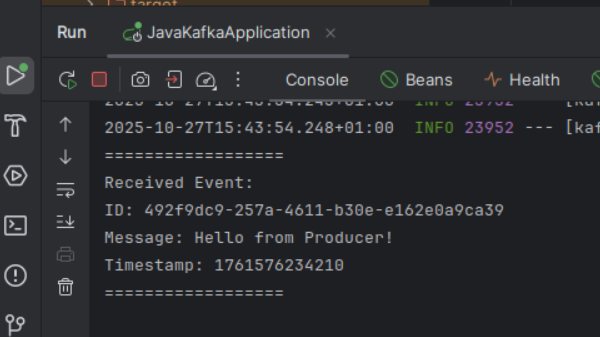
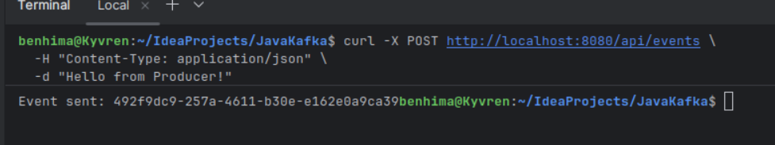

# Kafka Spring Cloud Stream Demo

Real-time event streaming and data analytics using Apache Kafka and Spring Cloud Stream.

## Project Structure
```
src/main/java/ma/enset/javakafka/
├── JavaKafkaApplication.java       # Main Spring Boot application
├── controller/
│   └── ProducerController.java     # REST API to publish events
├── service/
│   └── ConsumerService.java        # Consumes Kafka messages
├── model/
│   └── Event.java                  # Event data model
└── config/                         # Configuration classes (future)
```

### Components

- **Producer Service**: REST Controller (`/api/events`) to publish events to Kafka
- **Consumer Service**: Consumes and processes messages from Kafka topics
- **Supplier Service**: Auto-generates data streams (planned)
- **Stream Processor**: Real-time analytics with Kafka Streams (planned)
- **Web Dashboard**: Live data visualization (planned)

## Technologies

- Apache Kafka 4.1.0 (KRaft mode - no ZooKeeper)
- Spring Boot 3.x
- Spring Cloud Stream
- Docker & Docker Compose
- Lombok
- Maven

## Setup

### Part 1: Local Kafka (KRaft Mode)
```bash
# Generate Cluster UUID
KAFKA_CLUSTER_ID="$(bin/kafka-storage.sh random-uuid)"

# Format storage
bin/kafka-storage.sh format --standalone -t $KAFKA_CLUSTER_ID -c config/server.properties

# Start Kafka
bin/kafka-server-start.sh config/server.properties
```

### Part 2: Docker (Recommended)
```bash
# Start Kafka broker
docker compose up -d

# Verify running
docker compose ps

# View logs
docker compose logs -f broker

# Stop
docker compose down
```

### Part 3: Run Spring Boot Application
```bash
# Start application
mvn spring-boot:run

# Or run in IntelliJ: Click green play button
```

## Usage

### Send Event via REST API
```bash
curl -X POST http://localhost:8080/api/events \
  -H "Content-Type: application/json" \
  -d "Hello from Kafka Producer!"
```

### Test with Kafka Console Tools

**Producer:**
```bash
docker exec -it kafka-broker /opt/kafka/bin/kafka-console-producer.sh \
  --topic events --bootstrap-server localhost:9092
```

**Consumer:**
```bash
docker exec -it kafka-broker /opt/kafka/bin/kafka-console-consumer.sh \
  --topic events --from-beginning --bootstrap-server localhost:9092
```

## Kafka Topics

- `events` - Producer/Consumer events
- `data-stream` - Supplier auto-generated data
- `analytics` - Stream processing results

## Results

### Producer Sending Event


### Consumer Receiving Event


## Configuration

Key settings in `application.yml`:
- Kafka broker: `localhost:9092`
- Server port: `8080`
- Topics: `events`, `data-stream`, `analytics`

## Architecture
```
REST API (Producer) → Kafka Topic (events) → Consumer Service
                          ↓
                    Spring Cloud Stream
                          ↓
                   Kafka Streams (future)
```

## License

MIT